# 🎵 Music Library Management System


> A desktop music streaming platform built with custom Data Structures and Algorithms using JavaFX and Firebase. Developed as the Final Project for the **COMP1020 Object-Oriented Programming & Data Structures** course at VinUniversity (Spring 2026).

---

# 📖 Project Overview

This project provides a centralized and ad-free music management experience with:

* A responsive **Single-Page Application (SPA)** interface
* **Role-Based Access Control (RBAC)**
* Asynchronous synchronization with Firebase Realtime Database
* Optimized in-memory caching and search mechanisms
* Custom implementations of core Data Structures and Algorithms

The application focuses on combining practical software engineering with efficient algorithmic design.

---

# 🧠 Object-Oriented Programming Concepts

The system architecture applies several core OOP principles:

## Encapsulation

Data integrity is maintained within the `Song`, `Album`, and `User` models by keeping fields private and exposing controlled access through public getters/setters.

## Inheritance

A hierarchical user system is implemented where the abstract `User` class is extended by `Admin` and `ListenerUser`, allowing shared core attributes while supporting specialized behaviors.

## Abstraction

Controllers interact with simplified service methods such as `getTrendingSongs()`, while the service layer abstracts away caching and Firebase synchronization logic.

## Polymorphism

The UI dynamically adapts based on user roles. For example, administrative controls are conditionally rendered depending on the active session type.

---

# 🧱 Core Data Structures

## LinkedList & Stack (Navigation & Playback)

### Stack (LIFO)

Used for navigation history management. Each page transition pushes a UI node onto the stack, enabling efficient back-navigation in $\mathcal{O}(1)$ time.

### LinkedList (Queue)

Used to manage the playback queue for efficient next/previous track operations.

---

## Priority Queue (Top-K Selection)

A Min-Heap structure is used to maintain Top-K collections such as latest songs and albums.

* Time Complexity: $\mathcal{O}(N \log K)$
* Automatically removes older releases to maintain list size constraints

---

## Hash Map (In-Memory Caching)

A HashMap-based cache inside `LibraryManager` enables constant-time song retrieval and reduces repeated Firebase calls during frequent UI refreshes.

* Average Lookup Complexity: $\mathcal{O}(1)$

---

## AVL Tree & HashSet (Search Engine)

### AVL Tree

Acts as an inverted index storing searchable tokens extracted from song titles and artist names.

### HashSet

Each AVL node stores associated songs inside a HashSet to support fast intersection during multi-keyword searches.

---

# ⚙️ Algorithms

## Deterministic User ID Generation

### Polynomial Rolling Hash

Converts email strings into integer keys in $\mathcal{O}(L)$ time, where $L$ is the string length.

### Double Hashing & Multiplication Method

Used for collision handling and dynamic scaling.

Features:

* Amortized $\mathcal{O}(1)$ lookup complexity
* Reduced collision clustering
* Odd-step probing to prevent infinite loops

---

## Prefix Search Traversal

### Workflow

1. Split search queries into lowercase tokens
2. Traverse the AVL tree to retrieve candidate songs
3. Intersect candidate sets using `removeIf`
4. Filter songs that do not contain remaining tokens

### Complexity

* Prefix matching complexity: $\mathcal{O}(\log N + r)$

This approach performs significantly better than naive linear search for large music collections.

---

# 🚀 Installation & Execution

# Prerequisites

* Java Development Kit (JDK) 21 or higher
* Maven
* Eclipse or IntelliJ IDEA

---

# 1. Clone the Repository

```bash
git clone https://github.com/lamnguyen2407/-COMP1020-Music-Library-Management.git
```

Navigate to the project directory:

```bash
cd ./-COMP1020-Music-Library-Management
```

> **Note for Git Bash users:** The `./` prefix is highly recommended because the folder name starts with a hyphen (`-`). Without it, terminal environments like Git Bash might interpret the folder name as a command-line option and return an `invalid option` error.

---

# 2.1. Run via IDE (Recommended)

## Eclipse

### Step 1: Import as a Maven Project

1. Open Eclipse.
2. Go to **File → Import...**
3. Search for **Maven**.
4. Select **Existing Maven Projects** → **Next**.
5. Click **Browse...** and choose the cloned `-COMP1020-Music-Library-Management` folder.
6. Ensure that `pom.xml` is checked in the project list.
7. Click **Finish**.
8. Wait until Eclipse finishes downloading all Maven dependencies.

### Step 2: Run the Application

1. Right-click the project root (it should display a small **M** icon).
2. Select **Run As → Maven Build...**
3. In the **Goals** field, enter:

```text
clean javafx:run
```

4. Click **Run**.

---

## IntelliJ IDEA

1. Open the project.
2. Open the **Maven Tool Window**.
3. Navigate to:

```text
Plugins → javafx
```

4. Double-click:

```text
javafx:run
```

---

# 2.2. Run via Terminal

## macOS / Linux / Git Bash

```bash
./mvnw clean javafx:run
```

---

## Windows CMD

```cmd
mvnw clean javafx:run
```

---

## Windows PowerShell

```powershell
.\mvnw clean javafx:run
```

---

## Notes

**Note 1:** If the Maven Wrapper (`mvnw`) is missing, you can either generate it:

```bash
mvn wrapper:wrapper
```

or run the project using a globally installed Maven:

```bash
mvn clean javafx:run
```


**Note 2:** If you encounter a **"Failed to delete target"** error during execution (commonly caused by IDEs, file indexing services, or OneDrive locking files on Windows), you can safely skip the `clean` phase and run the application directly:

### macOS / Linux / Git Bash

```bash
./mvnw javafx:run
```

### Windows CMD

```cmd
mvnw javafx:run
```

### Windows PowerShell

```powershell
.\mvnw javafx:run
```

This issue does not affect the application source code. It only prevents Maven from deleting and recreating the `target/` directory before launching the application.

---

# 3. Test Credentials

Once the application is running, you can use the following pre-configured accounts to test the Role-Based Access Control (RBAC) features.

## Admin Account

```text
Email: admin1@musicapp.com
Password: admin
```

## Listener (User) Account

```text
Email: tester02@gmail.com
Password: tester
```

# 4. System UI and State Verification Screenshots

## Account View & Update
```text
User Account interface displaying current session metadata and allowing profile modifications.
```
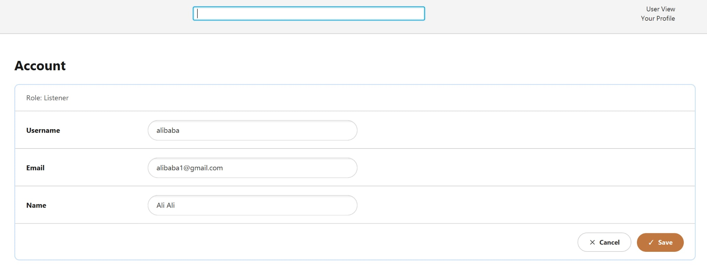

```text
Real-time Firebase synchronization confirming the updated user profile data (e.g, fullname: "Ali Ali")
```
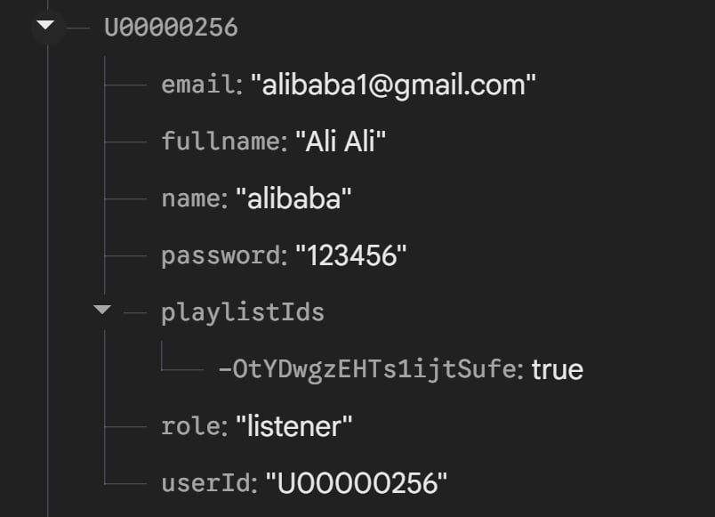

## User: Search Engine 
```text
Search engine accurately resolving a partial title query (”leave”) to fetch the exact track.
```
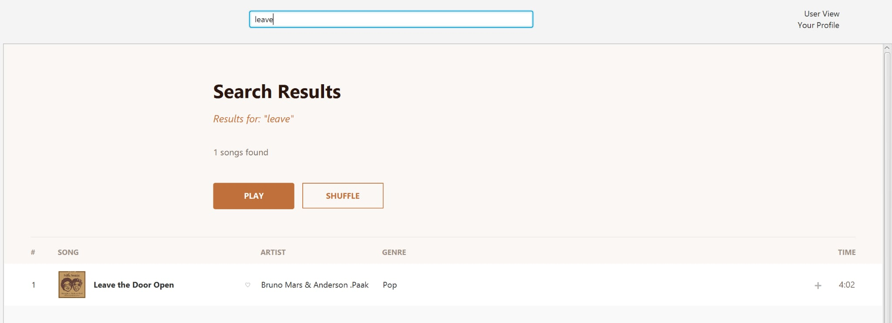

```text
Search engine demonstrating multi-attribute prefix matching, successfully retrieving all tracks where the artist’s name begins with ”bru” (Bruno Mars).
```
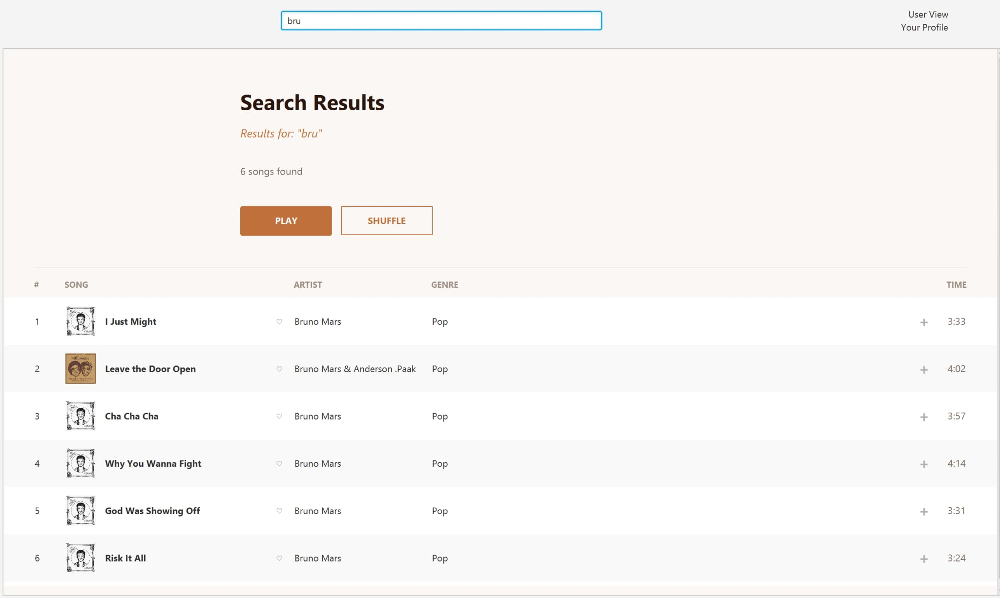

## Admin: Global Library Mutation
```text
Aministrative modal for inputting new track metadata and Google Drive media links.
```
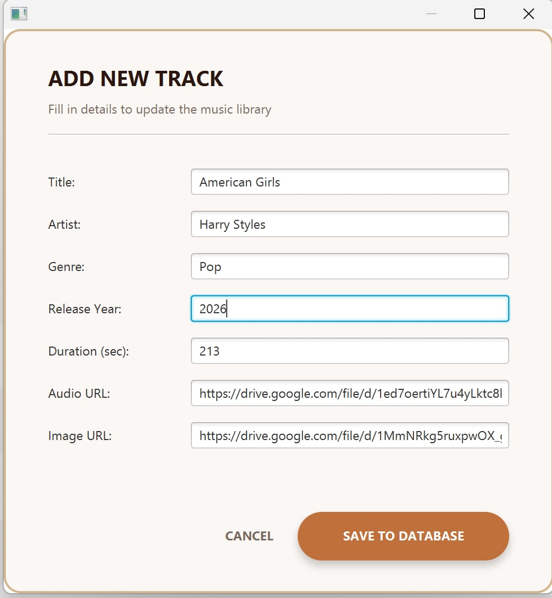

```text
Firebase database confirming the automatic conversion of input URL to the direct exportable streaming format.
```
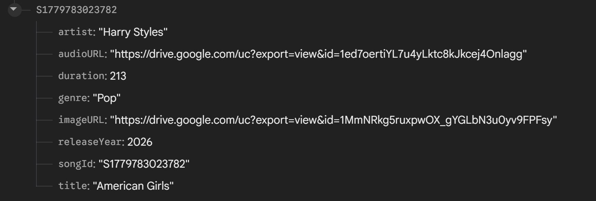

```text
The ’All Songs’ library view immediately reflecting the newly added track, ready for immediate playback.
```
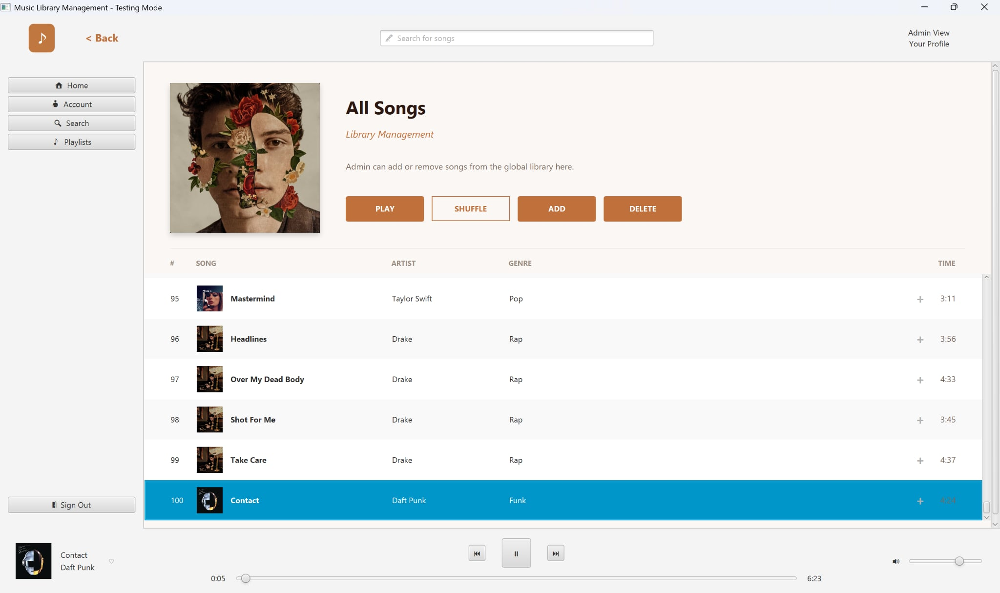

## Admin: Album management 
```text
Administrative interface for defining a new Album with global metadata.
```
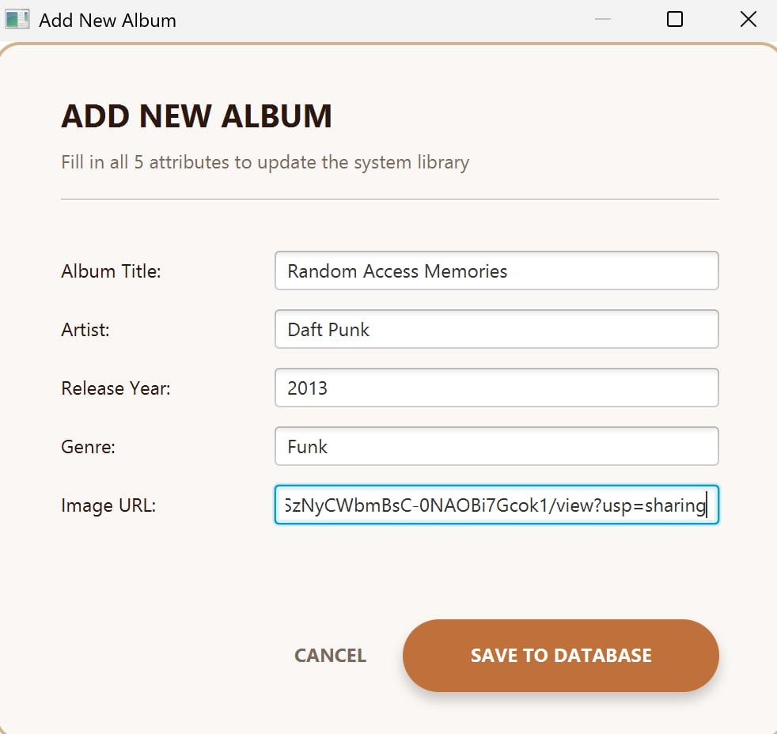

```text
Firebase root node for Albums, serving as the parent entity.
```
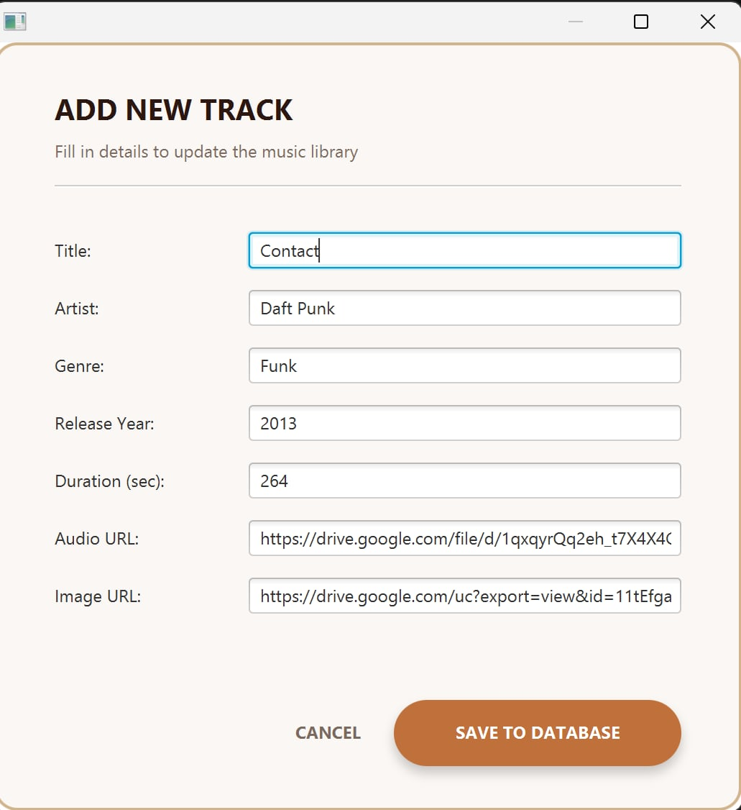

```text
Nested structure: Tracks inheriting shared attributes from the parent Album node.
```
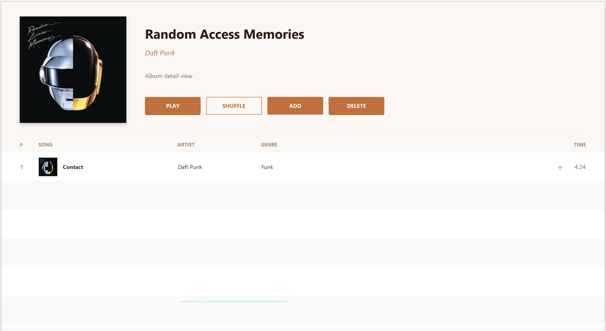

```text
Album detail view rendering tracks that successfully inherited parent metadata, ensuring consistency across the UI.
```
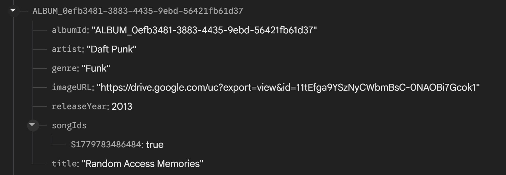

```text
Global library view automatically synchronizing the new track from the Album, ensuring the song is accessible via both Album and All Songs views.
```
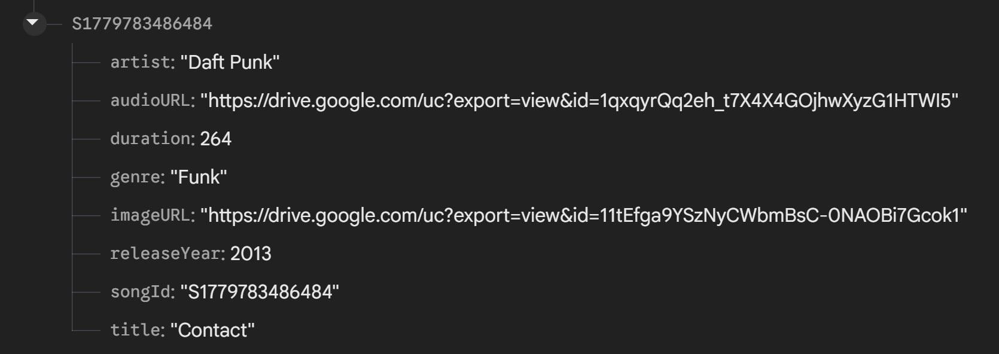


## Alternative Option

You can also use the **Sign Up** feature on the login screen to create a new account.

---


# 👥 Team Members (Team 2)

| Name                  | Student ID |
| --------------------- | ---------- |
| Nguyen Tuan Lam       | V202502497 |
| Nguyen Chu Hung Anh   | V202502224 |
| Nguyen Thi Hong Nhung | V202502876 |
| Hoang Thanh An        | V202502760 |
| Nguyen Nhat Thanh     | V202502691 |

---

# 🏫 Institution

**VinUniversity – College of Engineering and Computer Science**
